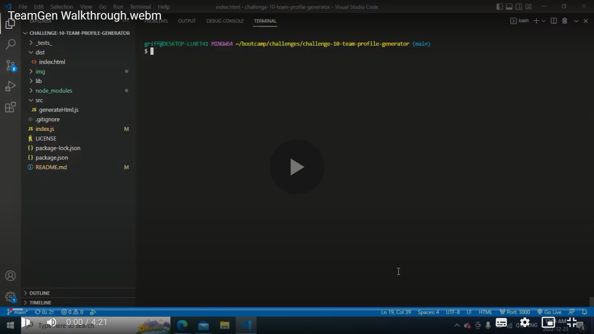
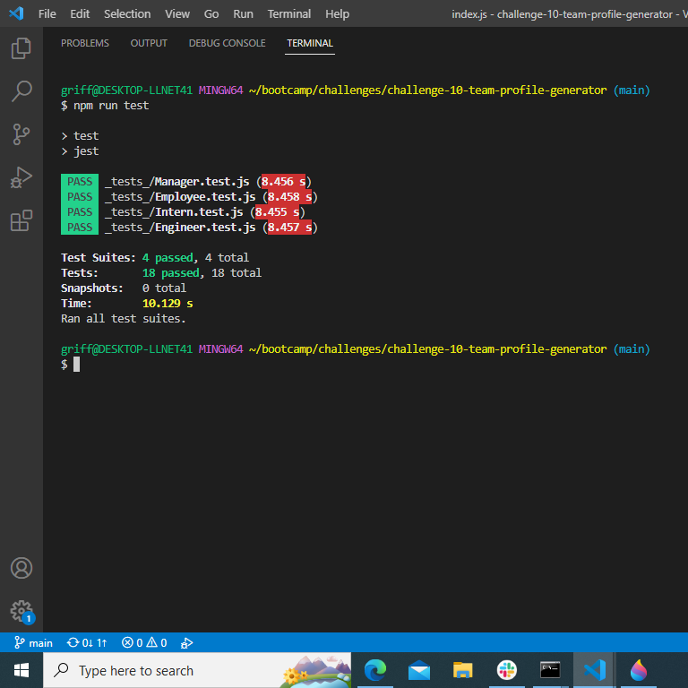
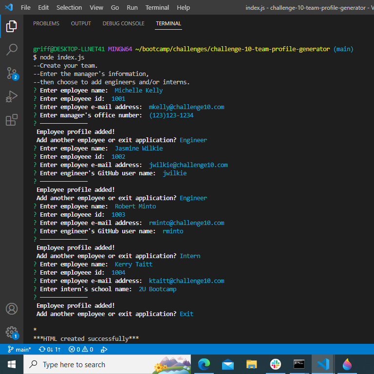
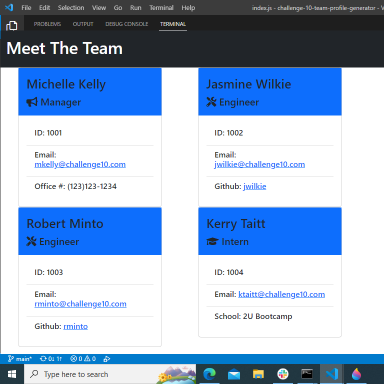

# TEAM PROFILE GENERATOR	

## Description

This application allows a user to quickly generate a team profile webpage using the command line interface.

## Table of Contents

- [Installation](#installation)
- [Final site](#final_site)
- [Walkthrough](#walkthrough)
- [Usage](#usage)
- [License](#license)
- [Badges](#badges)
- [Features](#features)
- [Tests](#tests)
- [Questions](#questions)
- [Screenshots](#screenshots)

## Installation

To run this application:  After downloading or cloning the repository and navigating to the correct folder using the command line, type "npm i" to install dependencies then type  "node index.js"  to run application.

## Final_Site

Link to html created by app:  [Team Profile Generator](./dist/index.html) 

## Walkthrough

https://drive.google.com/file/d/1LF9vyzf8_zUaKiBWMi5ACeH7eV0KrdZE/view

## Usage

To run tests type "npm run test" and to run app type "node index.js"
see  below.

## License

This project is licensed under the terms of the [MIT License](https://choosealicense.com/licenses/mit/).

## Badges

    

## Features

This application features validation methods to ensure user input is in the correct format:
- ID must be a number.
- E-mail must be a valid email address format i.e "user@domain".
- Office # must be a valid telephone number format i.e "(xxx)xxx-xxxx" or "xxx-xxx-xxxx" or "xxx xxx xxx" or "xxxxxxxxx".
- All fields are required.

## Tests

Tests have been included for all object methods. To run test at the command line type "npm run test"

## Questions

GitHub: [gregarijah](https://github.com/gregarijah) 

E-Mail: [greg.arijah@gmail.com](mailto:greg.arijah@gmail.com)

## Screenshots

